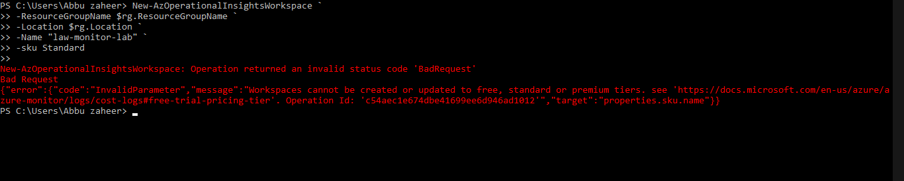
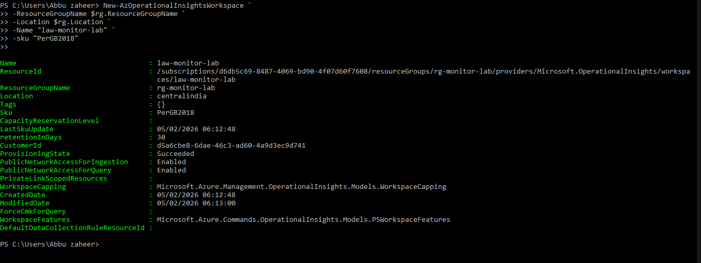
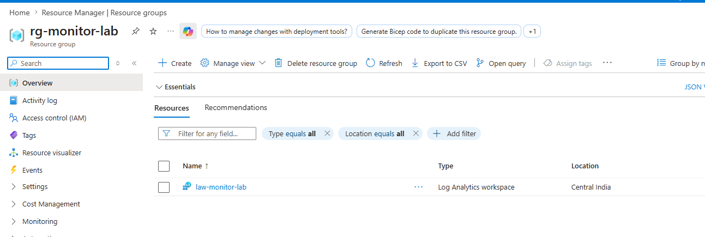
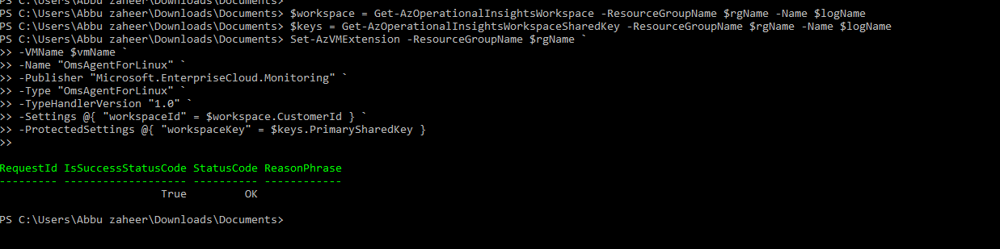
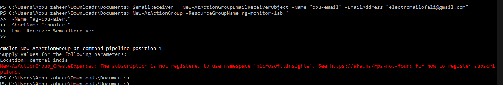
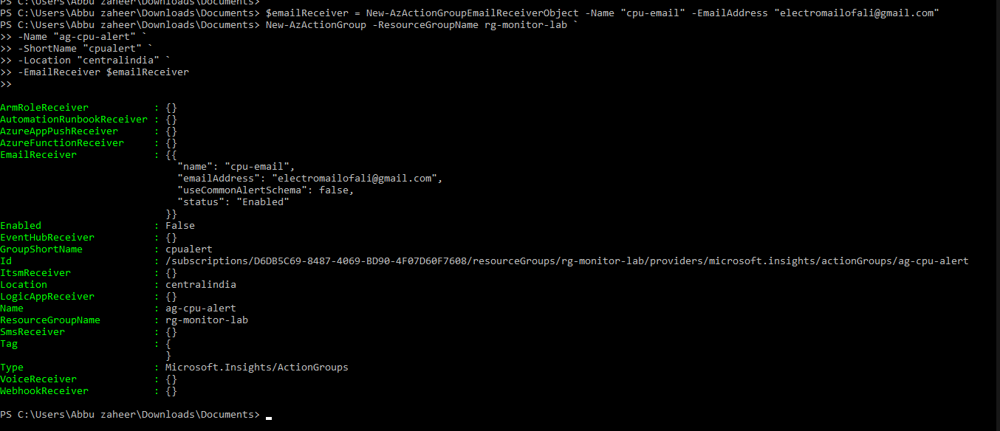
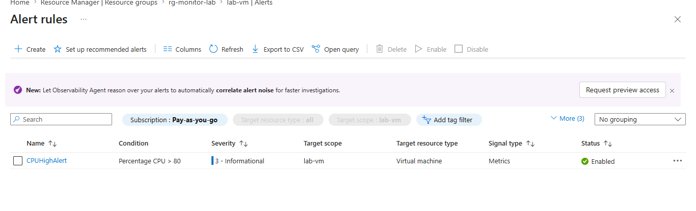
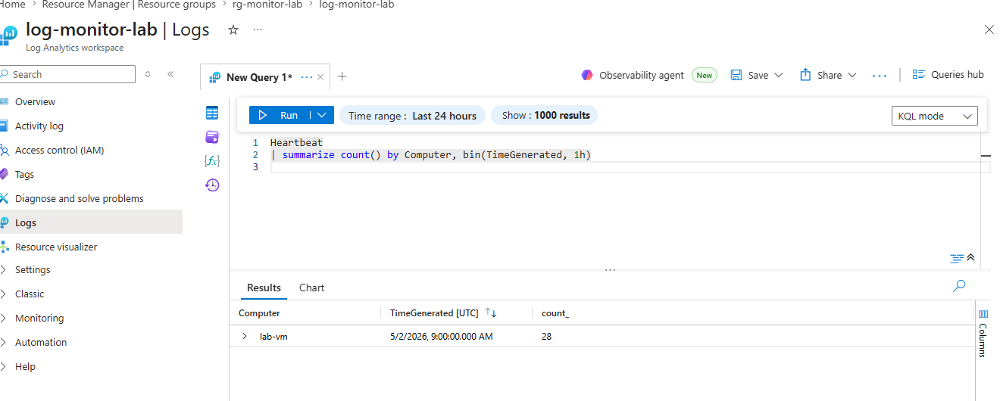

# Lab 7: Azure Monitor & Log Analytics

## 🎯 Objective
Configure Azure Monitor and Log Analytics to collect and analyze VM telemetry data.
Integrate a virtual machine with a Log Analytics Workspace, configure monitoring alerts using Azure Monitor, and execute KQL queries to analyze heartbeat and activity data for operational monitoring and troubleshooting.

## ⚙️ Resources Deployed
| Resource Type | Resource Name | Purpose |
|---|---|---|
| Resource Group | rg-monitor-lab | Logical container for monitoring resources |
| Log Analytics Workspace | law-monitor-lab | Centralized telemetry and log collection |
| Virtual Machine | lab-vm | Target VM for monitoring and telemetry |
| Azure Monitor Agent | OmsAgentForLinux | VM telemetry collection extension |
| Action Group | ag-cpu-alert | Email notification mechanism |
| Alert Rule | CPUHighAlert | CPU utilization monitoring |
| Monitoring Query | Heartbeat | Validate VM heartbeat telemetry |

## 🌐 Deployment Scope
- Provisioned and configured Azure Monitor and Log Analytics resources.
- Integrated Azure virtual machine telemetry with Log Analytics Workspace.
- Configured monitoring alerts and notification mechanisms using Azure Monitor.
- Executed KQL queries to validate telemetry ingestion and monitoring visibility.
- Performed troubleshooting for workspace SKU compatibility and provider registration issues.

## 📸 Screenshots

### **SKU Error While Creating Workspace (Troubleshooting)**  
Initially attempted to create the Log Analytics Workspace using the deprecated `Standard` SKU, which resulted in a provisioning failure.


### **Log Analytics Workspace Creation**  
Fixed the issue by creating the workspace with the supported 'PerGB2018' SKU.  


### **Workspace Listing**  
Verified that the Log Analytics Workspace was successfully provisioned and available within the resource group. 


### **VM Connection to Workspace**  
Connected the Linux virtual machine `lab-vm` to the Log Analytics Workspace using the Azure Monitor Agent extension for telemetry collection.


### **Action Group Creation Error (Troubleshooting)**  
Encountered subscription registration error for 'Microsoft.Insights' namespace while creating the action group. Registered the provider to resolve it.  


### **Action Group Creation**  
Resolved the provider registration issue and successfully created the action group `ag-cpu-alert` with email notification configuration.


### **Alert Rule Configuration (Portal)**  
Configured a CPU utilization alert rule in the Azure Portal with threshold conditions greater than 80% and linked it to the action group.


### KQL Heartbeat Query Execution
 
Executed KQL heartbeat queries in Log Analytics to validate telemetry ingestion and monitor VM reporting activity.
 
Example Query:
 
```kql
Heartbeat
| summarize Count = count() by Computer, bin(TimeGenerated, 1h)
```
 

 
---

## 📊 Operational Validation
- Successfully provisioned the Log Analytics Workspace using the supported PerGB2018 SKU.
- Verified successful telemetry integration between lab-vm and the Log Analytics Workspace.
- Confirmed Action Group creation with email notification configuration.
- Validated CPU alert rule deployment and monitoring configuration in Azure Monitor.
- Successfully executed KQL heartbeat queries and confirmed telemetry ingestion.
- Resolved workspace SKU compatibility and Microsoft.Insights namespace registration issues.


## **📚 Key Learnings**
- How to provision and configure a Log Analytics Workspace.
- How to integrate Azure virtual machines with Azure Monitor using monitoring agents.
- How to configure Action Groups and Alert Rules for proactive monitoring.
- How to troubleshoot Azure Monitor deployment issues such as deprecated SKUs and provider registration failures.
- How to execute KQL queries to analyze heartbeat telemetry and operational logs.
- Understanding the operational workflow of Azure Monitor and Log Analytics integration.

## **📌 Resume Alignment**
- Configured Azure Monitor and Log Analytics Workspace for centralized VM telemetry collection and operational monitoring.
- Integrated Azure virtual machines with Azure Monitor Agent extensions for telemetry ingestion.
- Created CPU utilization alert rules and Action Groups for proactive infrastructure monitoring.
- Executed KQL heartbeat queries to validate telemetry ingestion and analyze monitoring data.
- Troubleshot and resolved Azure Monitor deployment issues related to SKU configuration and provider namespace registration.
